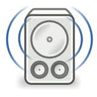

**The short and the long:**
-----------

  
I though I would share this, should someone look for something similar and happen upon this. 

The easiest way I found to send the keystrokes through Python is by installing ***xdotool*** which is a unix based scripting tool, wich is pretty awesome. It supports all the multimedia keys. Including the context menu a.k.a "Menu". 

***So what did I need it for?***  
I built a remote for my ubuntu since my Compro Remote stopped working.

***How does it work?***  
It leverages Apache, Bootstrap, PHP, Redis, Python and finally xdotools (Boy that's a mouthfull). I created a mini website which I access through my WIFI with remote buttons which when clicked sends the command in the background to the PHP  Script running on Apache.

This PHP script then saves the command and values in Redis which is polled constantly by Python. Once Python picks the command up. It checks it in the dictionary of commands and sends the appropiate command line to xdotool. Xdotool then runs the Media Keys or starts Rhythmbox or XBMC or pauses and plays. Whatever. So far it's working like a charm.

----------

## The CODE ##
***index.php***    
Generates the remote through web interface  
<!-- language-all: lang-php -->
    <?php
    
    require 'classes/class.redis.php'; // find it here https://github.com/sash/php-redis  
    require 'classes/class.remotecontrol.php'; 
    $r = new RemoteControl(); // Start the class which does the grunt work
        
    // This API will look for get variables pushed through from the page and then adds it in redis.
    // it looks for something like remote.php?command=key&value=up and stores it
    if (  (isset($_GET['command']))
    && (isset($_GET['value']))  )
    {
        echo (int)$r->add($_GET['command'], $_GET['value']);    // Returns 1 or 0 for the jQuery Ajax
        // $r->add adds the following to redis
        /*   $this->redis->set('command', $command);
             $this->redis->set('value', $value);
             $this->redis->set('timestamp', time());
             $last = $this->redis->set('read', 0);  */
        die(); // We need nothing else from this call, so lets stop execution here
    }
    
    
    // Simple as that, now all that's lets is to create the page to display the remote.
    // For this we use a mixture or jQuery and Bootstrap from twitter
    // http://twitter.github.com/bootstrap/index.html
    // http://jquery.com/
    ?>

<!-- language-all: lang-html -->  

    <!DOCTYPE html>
    <html>
        
        <head>
            <title>Remote control</title>
            <!-- Bootstrap -->
            <link href="assets/css/bootstrap.min.css" rel="stylesheet" media="screen">
        </head>
        
        <body>
            <!-- Main Container, to center the remote -->
            

                 
                
                <!-- We need to set width limits in order to center spans -->
                <!-- Main remote container -->
                

                    
                    <!-- Direction arrows and ok button -->
                    

                        

                            <!--
                                You may notice I have some data-{variable} html attributes. These are used by my script later
                                The data-keycode is the keycode value for the button pressed, this makes it a bit easier to use
                                Don't know how to pick this up, check my remote.js file
                                
                                The id is the action to be performed. And the click is picked up with the "remoteKeys" and "volume" classes
                            -->
                            <a href="#" data-keycode="119" id="up" class="remoteKeys btn btn-large btn-inverse">
                                <i class="icon icon-white icon-arrow-up"></i>
                            </a>
                        

                        
                         
                
                        

                            <a href="#" data-keycode="97" id="left" class="remoteKeys btn btn-large btn-inverse">
                                <i class="icon icon-white icon-arrow-left"></i>
                            </a>
                                &nbsp;&nbsp;&nbsp;            
                            <a href="#" data-keycode="13" id="ok" class="remoteKeys btn btn-large btn-primary">OK</a>
                                &nbsp;&nbsp;&nbsp;
                            <a href="#" data-keycode="100" id="right" class="remoteKeys btn btn-large btn-inverse">
                                <i class="icon icon-white icon-arrow-right"></i>
                            </a>        
                        

                        
                         
                
                        

                            <a href="#" data-keycode="115" id="down" class="remoteKeys btn btn-large btn-inverse">
                                <i class="icon icon-white icon-arrow-down"></i>
                            </a>                 
                        
        
                    

                    
                    <!-- Play, stop, next and prev as well as XBMC and Music icons -->
                    

                        

                            

                                <a href="#" id="prev" class="remoteKeys btn btn-large">
                                    <i data-keycode="98" class="icon icon-backward"></i>
                                </a>
                                <a href="#" id="play" class="remoteKeys btn btn-large">
                                    <i data-keycode="32" class="icon icon-play"></i>
                                </a>
                                <a href="#" id="next" class="remoteKeys btn btn-large">
                                    <i data-keycode="110" class="icon icon-forward"></i>
                                </a>
                            

                            
                             
                            
                            

                                <a data-keycode="27" href="#" id="back" class="remoteKeys btn btn-large">
                                    <i class="icon icon-repeat"></i>
                                </a>
                                    &nbsp;&nbsp;&nbsp;
                                <a href="#" data-keycode="105" id="info" class="remoteKeys btn btn-large">
                                    <i class="icon icon-info-sign"></i>
                                </a>
                            

                            
                             
                            
                            
                     
                            <a href="#" data-keycode="120" id="xbmc" class="remoteKeys">
                                                    
                            </a>
                            <a href="#" data-keycode="114" id="music" class="remoteKeys">
                                                    
                            </a>
                            

                            
                        

                        
                    
 
                
<!-- Done with the main remote component -->
                
                

                
                <!-- Time for the volume controls -->
                

                    
               
                        <button class="btn btn-large volume" data-keycode="113" data-value="down">Volume Down <i class="icon icon-volume-down"></i></button>                
                        <button class="btn btn-large activity"><i class="activity-icon icon icon-heart"></i></button>           
                        <button class="btn btn-large volume" data-keycode="101" data-value="up">Volume Up <i class="icon icon-volume-up"></i></button>
                    

                

        
            
<!-- </main div> -->
            
            <!-- Lastly the javascript needed -->        
            
            
                  
        </body>
    </html>

***Remote.js***  
This is what will detect key and button presses and send the command to the PHP script  

<!-- language: lang-js -->

    // Lets make it easy to change the filename
    var myScript = "index.php";

    // When the key is pressed, set it in the DB by running the AJAX
    $(".remoteKeys").click(function(event) {
            event.preventDefault();        
            var keyPressed = $(this).attr('id');
    	$.get(myScript, { command: "key", value: keyPressed },
    	function(data){
    		if (data == 1)
    		{
    			$(".activity").addClass("btn-primary");
    			$(".activity-icon").addClass("icon-white");
    		} else {
    			$(".activity").addClass("btn-danger");
    			$(".activity-icon").addClass("icon-white");
    		}
    		setTimeout(clear, 200);
    	});
    });
    
    // Lets set up some quick buttons
    $(document).keypress(function(event) {
    	event.preventDefault();
    	//alert(event.which); // Keep this to check the keys, just uncomment the first section
    	$('[data-keycode="' + event.which + '"]').click();	
    });
    
    // Clear the activity display 
    function clear() {	
    	$(".activity").removeClass("btn-primary btn-danger");
    	$(".activity-icon").removeClass("icon-white");
    };
    
    // When a volume key is pressed.
    $(".volume").click(function(event) {
            event.preventDefault();        
            var getVolume = $(this).attr('data-value');	
    	$.get(myScript, { command: "volume", value: getVolume },
    	function(data){
    		if (data == 1)
    		{			
    			$(".activity").addClass("btn-primary");
    			$(".activity-icon").addClass("icon-white");
    		} else {
    			$(".activity").addClass("btn-danger");
    			$(".activity-icon").addClass("icon-white");
    		}
    		setTimeout(clear, 200);
    	});
    });

***class.remotecontrol.php***  
All this really does is take the action sent through from the jQuery and adds the values to Redis so Python can pick it up.   

<!-- language-all: lang-php -->

    <?php
        // Create the remote object
        class RemoteControl
        {
    	public $redis;
    	
    	// Bootstrap / Init the class by creating an instance for Redis
            public function __construct()
            {
    	    $this->redis = new Redis();
    	    $this->redis->debug=false;	   
            }
    	
    	// Add the values to Redis which Python polls for the info
    	public function add($command, $value)
    	{
    	    $this->redis->set('command', $command);
    	    $this->redis->set('value', $value);
    	    $this->redis->set('timestamp', time());
    	    $last = $this->redis->set('read', 0);	
    	    if ($last == "OK"){
    		return 1;
    	    } 
    	    return 0;
    	}
        }    
    ?>

***Remote.py***  
This baby goes into Redis and checks for commands and dispatches the relevant command to the linux kernel to be actioned. Very nice! **Remember to make this executable if you want to launch with it** *(sudo chmod +x remote.py)*  
<!-- language: lang-js -->  

    #!/usr/bin/env python
    # Import the python modules we will need
    import time, subprocess, redis
    
    # Lets get connected to Redis
    Redis = redis.Redis("localhost");
    
    # This will get the current command from Redis and if it's a volume key then run the volume function
    # Otherwise run the commandKeys, these two could be combined but it works now so I will leave it alone
    def getCommand():   
        
        # Get the actual values from Redis
        command = Redis.get("command");
        value = Redis.get("value");
        timestamp = Redis.get("timestamp");
        
        # Run the command in question
        if command == 'volume':
            volume(value)
            
        if command == 'key':        
            commandKeys(value)
        
        # We need to set read to true so we do not loop through the same action all the time     
        Redis.set("read", 1)
     
    # This will perform the actions   
    def commandKeys(pressed):
        
        # The dictionary with the commands and switches to be run
        keyDict = {'up':['xdotool', 'key', "Up"],
                'down':['xdotool', 'key', "Down"],
                'left':['xdotool', 'key', "Left"],
                'right':['xdotool', 'key', "Right"],
                'ok':['xdotool', 'key', "KP_Enter"],
                'play':['xdotool', 'key', "XF86AudioPlay"],
                'info':['xdotool', 'key', 'Menu'],
                'back':['xdotool', 'key', "Escape"],
                'next':['xdotool', 'key', "XF86AudioNext"],
                'prev':['xdotool', 'key', "XF86AudioPrev"],
                'xbmc':['xbmc'],
                'stop':['xdotool', 'key', "XF86AudioStop"],
                'music': ['xdotool', 'key', "XF86Go"],
                }
        
        # Was the keypress valid? If so, run the relevant command
        if pressed in keyDict:        
            xdotool(keyDict[pressed])
        else:
            print pressed, "command not found, Eish"
    
    # Same as commandKeys, but for volumes
    def volume(upDown):
        
        # Direction to move the volume
        directions = {'up':['xdotool', 'key', "XF86AudioRaiseVolume"],
                      'down':['xdotool', 'key', "XF86AudioLowerVolume"] }
        
        # Is the command value in the dictionary above? Then run the relevant command
        if upDown in directions:        
            xdotool(directions[upDown])
        else:
            print pressed, "you want the volume to go where?"
     
    # This little baby is what sends the command from the dictionary to the kernel to be processed.
    def xdotool(action):
        ps = subprocess.Popen(action);
        print action #Comment this out, if you do not want to see which action was taken. Usefull for debugging
        
        
    # This is the main loop with a small time delay so we do not chow the CPU to bits
    while 1:
        
        # Check if a remote key was pressed by quering Redis
        if int(Redis.get("read")) == 0:
            
            # Lets get the command
            getCommand()  
            
        time.sleep(0.1) # Little sleep required (Don't we all)

